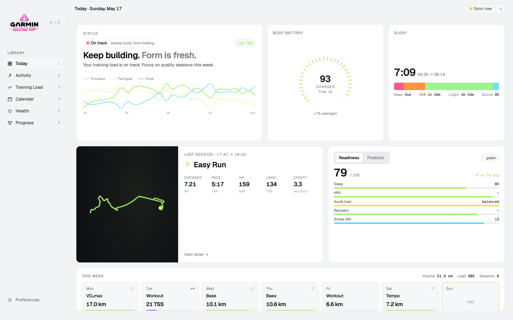
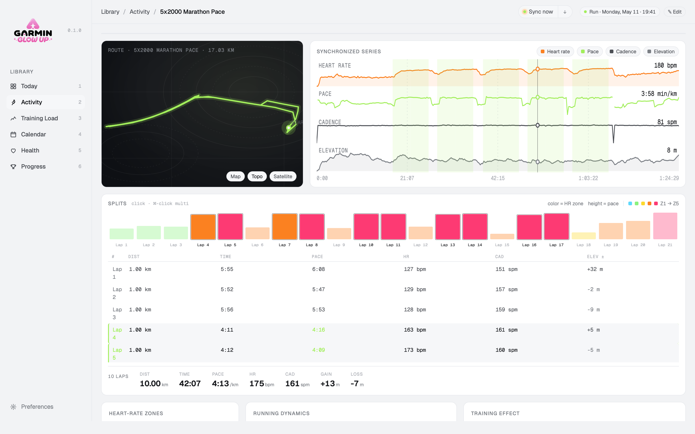
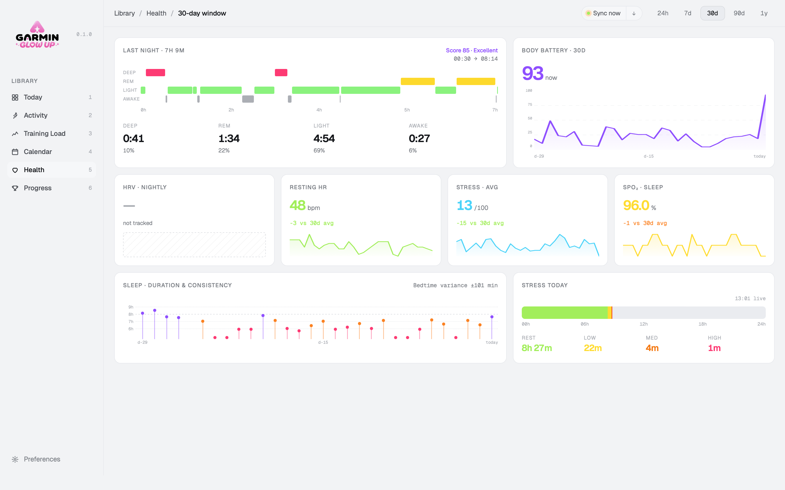
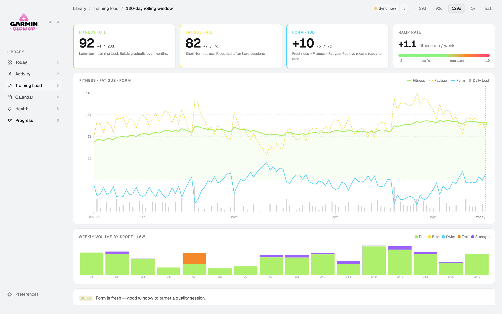

<div align="center">

# Garmin Glow Up

**What if Garmin Connect actually looked good?**

[](https://github.com/Grominet95/garmin-glow-up)
[](packages/tempo-sync)
[](packages/tempo-desktop)
[](LICENSE)

<br/>



<br/>

<table>
  <tr>
    <td width="33%"></td>
    <td width="33%"></td>
    <td width="33%"></td>
  </tr>
</table>

</div>

---

Garmin makes great hardware. The software, not so much. Garmin Glow Up is a native macOS app that pulls your data from Garmin Connect and presents it the way it deserves: clean, fast, and actually pleasant to look at.

Not affiliated with Garmin Ltd. Uses the unofficial Connect API. All Garmin trademarks belong to their respective owners.

---

## What you get

- A daily dashboard with your form curve (CTL / ATL / TSB), sleep quality, body battery, and last session at a glance
- Real GPS route maps, lap splits, and HR zone breakdowns
- Your training week laid out simply, no clutter
- Everything runs locally. Your data stays on your machine.

---

## Architecture

Two processes, one contract. They talk over a REST API on loopback and never share a database directly.

```
tempo-sync        Python FastAPI on 127.0.0.1:8765
                  Garmin SSO, FIT parsing, SQLite, scheduler

tempo-desktop     Tauri 2 + React 19 native app
                  Reads from tempo-sync via HTTP, stores nothing itself
```

---

## Prerequisites

| Tool | Version | Install |
|------|---------|---------|
| Node.js | 20+ | [nodejs.org](https://nodejs.org) |
| pnpm | 9+ | `npm i -g pnpm` |
| Python | 3.12+ | [python.org](https://python.org) |
| uv | latest | `curl -LsSf https://astral.sh/uv/install.sh \| sh` |
| Rust | stable | `curl --proto '=https' --tlsv1.2 -sSf https://sh.rustup.rs \| sh` |

---

## Quick start

```bash
git clone https://github.com/Grominet95/garmin-glow-up.git
cd garmin-glow-up
bash setup.sh
```

The setup script checks your prerequisites, installs dependencies, runs database migrations, and walks you through connecting your Garmin account. Credentials are stored in the macOS keychain, never on disk.

---

## Repo layout

```
garmin-glow-up/
├── packages/
│   ├── tempo-sync/       Python FastAPI service + SQLite
│   └── tempo-desktop/    Tauri 2 + React 19 desktop app
├── docs/                 Technical specifications
├── design/               Original design canvas and reference files
└── .github/workflows/    CI + release pipelines
```

---

## Tech stack

**Backend (tempo-sync)**
Python 3.12, FastAPI, SQLAlchemy, Alembic, APScheduler, garminconnect, fitparse, keyring

**Frontend (tempo-desktop)**
React 19, TanStack Router, TanStack Query, Zustand, Tailwind CSS, Tauri 2

---

## License

`tempo-sync`: MIT
`tempo-desktop`: AGPL-3.0
